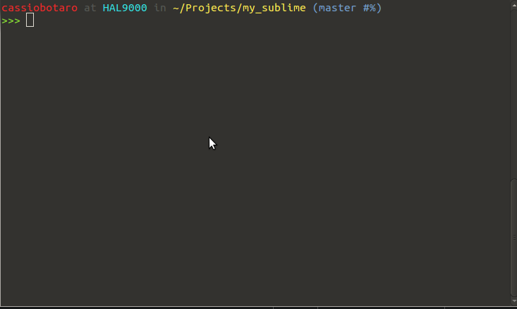

dot_files
=========

my dot files to improve productivity on ubuntu.

###Install

Copy .bash_aliases, .bash_completion and .bashrc to `~/` .
	
	cp .bashrc ~/
	cp .bash_aliases ~/
	cp .bash_completion ~/

####Files

###.bash_aliases

- git aliases
	* cd alias 		- 	. for each cd .. until max of 3
	* apt alias 	- 	alias for aptget commands
	Example:
		install -> sudo apt-get install
        update  -> sudo apt-get update
        upgrade -> sudo apt-get upgrade
	* python utils  -   calendar, server, pydoc, timeit, profile
    * git alias		-   git commands
	Example:
		ga   -> git add
        gcl  -> git clone
        gc   -> git commit
		gco  -> git checkout
    * tree          -   better directory visualisation
    * vagrant       -   vagrant alias
	Example:
		vup  -> vagrant up
        vssh -> vagrant ssh
        vh   -> vagrant halt
    * kernel clean  -   remove older kernel using kernelcleanup

To list all aliases type `alias` at the terminal.

###bash_completion

Git, django, vagrant and pip completions.

###bashrc

Better ps1 with color and git status.

